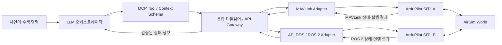

# SkyBuddy

> 산악 실종자 수색 시나리오 검증을 위한 MCP 기반 LLM 다중 드론 오케스트레이션 프로토타입

SkyBuddy는 산악 실종자 수색 상황에서 서로 다른 통신 인터페이스를 사용하는 여러 드론의 상태를 통합하고, LLM이 수색 임무를 배정하며, MCP 기반 미들웨어가 그 결과를 드론별 실행 명령으로 변환할 수 있는지 검증하는 프로젝트입니다.

실제 기관에 도입할 완성형 관제 플랫폼을 만드는 것이 아니라, AirSim 기반의 제한된 시뮬레이션 환경에서 MAVLink와 AP_DDS 기반 ArduPilot ROS 2 인터페이스를 통합 제어하는 가능성과 한계를 실험하는 것을 목표로 합니다.

## 프로젝트 목표

- AirSim과 ArduPilot SITL을 이용해 2대 이상의 가상 드론을 운용합니다.
- 한 드론은 MAVLink로, 다른 드론은 AP_DDS 기반 ROS 2 인터페이스로 제어합니다.
- 프로토콜별 Adapter가 수집한 위치, 배터리, 연결 및 임무 상태를 공통 형식으로 정규화합니다.
- 자연어 수색 명령과 드론 상태를 바탕으로 LLM이 탐색 구역과 임무를 배정합니다.
- MCP Tool/Context Schema를 통해 LLM과 미들웨어의 인터페이스를 명확히 정의합니다.
- 미들웨어가 LLM의 구조화된 출력을 검증하고 MAVLink Mission 또는 AP_DDS 위치·속도 목표로 변환합니다.
- 배터리 부족, 드론 가용 상태 변화, 통신 지연 등의 상황에서 임무 재배정과 Fallback을 검증합니다.
- 반복 실험을 통해 프로토콜별 명령 변환 성공률, 응답 시간, 상태 누락률, 탐색 커버리지 등의 지표를 측정합니다.

## 시스템 흐름

LLM은 비행기의 자세나 모터를 직접 제어하지 않습니다. 탐색 구역 분할과 드론별 임무 배정 같은 상위 의사결정을 담당하며, 실제 비행 명령의 변환·실행과 안정성은 미들웨어의 프로토콜별 Adapter와 ArduPilot 비행 제어 계층이 담당합니다.

MAVLink와 AP_DDS는 AirSim과 SITL 사이의 물리 시뮬레이션 연결이 아니라 SkyBuddy와 ArduPilot 사이의 상위 명령·상태 인터페이스로 사용합니다. 두 드론은 같은 ArduPilot 비행 스택을 사용하며 통신 인터페이스만 다르게 구성합니다.

## 핵심 시나리오

1. 사용자가 산악 실종자 수색 임무를 자연어로 입력합니다.
2. 미들웨어가 각 드론의 위치, 배터리, 가용 상태와 탐색 진행 상황을 수집합니다.
3. LLM이 탐색 구역을 분할하고 드론별 임무를 생성합니다.
4. 구조화 출력 검증을 통과한 임무만 대상 드론의 MAVLink 또는 AP_DDS 명령으로 변환됩니다.
5. 가상 드론이 할당된 구역을 탐색하고 상태 및 수행 로그를 반환합니다.
6. 배터리 부족이나 드론 이탈이 발생하면 남은 드론에 임무를 재배정합니다.

탐색 구역에서 생성한 경로는 프로토콜 중립적인 목표점 목록으로 관리합니다. MAVLink Adapter는 이를 Mission으로 변환할 수 있고, AP_DDS Adapter는 전역 위치 목표를 순차 전송하고 상태 토픽으로 각 목표점 도달 여부를 확인합니다.

## 시스템 구성

| 구성 요소 | 책임 |
|---|---|
| LLM 오케스트레이터 | 자연어 명령 해석, 탐색 구역 분할, 임무 배정 및 재배정 |
| MCP 인터페이스 | Context 및 Tool Schema 정의, 도구 호출 규격화 |
| 통합 미들웨어 | 상태 데이터 표준화, 출력 검증, API Gateway, 프로토콜 선택, Fallback |
| 프로토콜 Adapter | 공통 명령을 MAVLink 또는 AP_DDS 명령으로 변환하고 상태를 공통 모델로 정규화 |
| 시뮬레이션 | 동일 AirSim World의 복수 ArduPilot SITL 인스턴스와 비행 임무 실행 |
| 검증 계층 | 프로토콜별 실험 로그 수집, KPI 계산, 최소 상태 모니터링 |

## 역할 분담

| 담당 | 역할 |
|---|---|
| 박병언 | 통합 미들웨어, MAVLink/AP_DDS Adapter, API Gateway, 데이터 스키마, 로그 수집·처리 및 KPI 파이프라인, 명령 변환 및 Fallback |
| 배성열 | LLM 오케스트레이션, MCP 인터페이스, 임무 배정 및 재배정 |
| 이태우 | AirSim/ArduPilot 다중 SITL, MAVLink 및 AP_DDS 연동, 수색 시나리오 및 KPI 실험 |

## 예정 기술 스택

아래 기술은 초기 계획이며, 기술 검증 결과에 따라 조정될 수 있습니다.

- **Simulation:** AirSim, ArduPilot SITL
- **Drone interfaces:** MAVLink, ArduPilot AP_DDS 기반 ROS 2 인터페이스
- **Protocol clients:** pymavlink, ROS 2 Humble, micro-ROS Agent
- **Middleware:** Python, FastAPI, Pydantic, OpenAPI
- **LLM integration:** MCP, Tool Calling, JSON Schema 기반 구조화 출력
- **Streaming and monitoring:** WebSocket 또는 SSE
- **Experimentation:** 반복 시뮬레이션, 로그 수집 및 KPI 분석

## 검증 지표

- 2대 이상 가상 드론의 동시 운용 성공 여부
- MAVLink 및 AP_DDS 상태 데이터의 공통 모델 변환 정확도와 누락률
- MCP 및 API Schema 준수율
- LLM 구조화 출력 성공률
- 임무 배정 성공률과 프로토콜별 명령 변환·실행 성공률
- 중복 탐색 발생률과 탐색 구역 커버리지
- LLM, API, MAVLink Adapter, AP_DDS Adapter 단계별 응답 시간
- MAVLink Heartbeat 또는 AP_DDS 상태 토픽 단절 상황에서의 Fallback 및 임무 재배정 성공 여부

구체적인 목표값과 실험 조건은 초기 베이스라인을 측정한 뒤 확정합니다.

## 범위에서 제외하는 항목

- 실제 경찰·소방·군 기관의 운영 시스템 대체
- 실제 비행과 기관 통신망 연동
- 서로 다른 제조사 또는 서로 다른 flight stack 간의 통합 검증
- AP_DDS가 MAVLink의 모든 마이크로서비스를 완전히 대체한다는 검증
- UTM 구축 또는 대체
- 복수 재난 시나리오 동시 구현
- 고도화된 자율 군집 제어와 편대비행
- 실시간 충돌 회피 및 Multi-Agent Path Finding
- 이상 탐지 AI 모델과 대규모 부하 테스트
- 상용 수준의 관제 대시보드

## 프로젝트 단계

1. **탐색:** 기술 조사, 외부 자문 반영, 시나리오와 측정 기준 확정
2. **설계:** 시스템 아키텍처, API, MCP Context/Tool Schema 정의
3. **구현:** 시뮬레이터, 미들웨어, LLM 오케스트레이터 독립 개발
4. **통합:** 상태 수집부터 임무 실행까지 전체 파이프라인 연동
5. **검증:** 정상 및 장애 시나리오 반복 실험과 KPI 측정
6. **정리:** 재현 가능한 실행 방법, 결과 보고서, 시연 영상 문서화

## 현재 상태

프로젝트 요구사항과 역할 범위를 정리하는 초기 단계입니다. 개발 환경, 저장소 구조, 실행 방법은 기술 검증을 진행하면서 추가할 예정입니다.

## 문서 및 개인정보 관리

- 문서는 기술 문서 및 명세서 위주로 업로드할 예정입니다.

## License

라이선스는 아직 결정되지 않았습니다.
